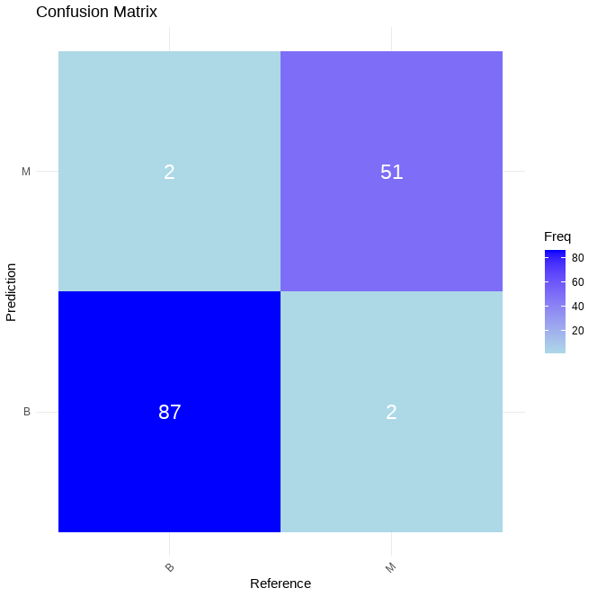

# Breast Cancer Classification in R using Random Forest

**Key Skills**

- Data Preprocessing
- Random Forest Model in R
- Evaluation Metrics of Machine Learning Model
- Git/GitHub Version Control

# Project Overview

This project shows an implementation, in R, of a Random Forest classification model. This is used to classify breast cancer tissue samples as either **Malignant (M)** or **Benign (B)**.

# Dataset 

The dataset used in this project is the publicly available **Wisconsin Breast Cancer Dataset (Diagnostic)**
- Source: Wolberg, W., Mangasarian, O., Street, N., & Street, W. (1993). Breast Cancer Wisconsin (Diagnostic) [Dataset]. UCI Machine Learning Repository. https://doi.org/10.24432/C5DW2B

## Example of Biopsy Samples

# Evaluation Metrics

## Model Accuracy

The Random Forest classification model achieved an accuracy of **97.18%**, with a **True Positive Rate** of **97.75%** and a **True Negative Rate** of **96.23%**. The TP/TN/FP/FN breakdown can be seen in the Confusion Matrix below.

## Confusion Matrix for Classification Results

